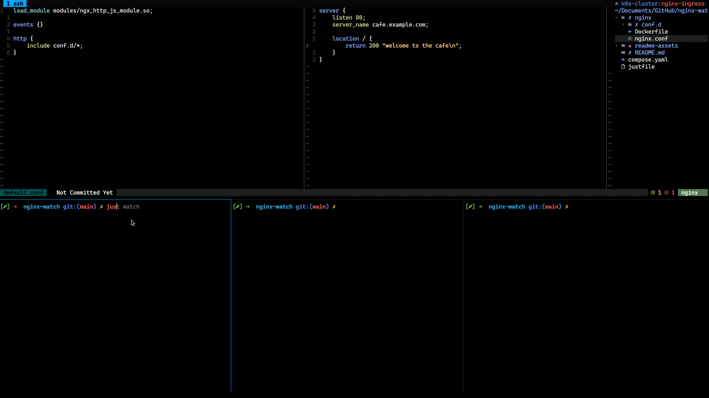

# nginx-watch
Docker Compose watch for NGINX





## Requirements

- [Docker Compose](https://docs.docker.com/compose/)
- [Just](https://github.com/casey/just)

## Setup 

- Run `just watch` in one terminal
- Run `just logs` in another. 

Upon making a change to `nginx.conf`, or to files in the `conf.d` directory, NGINX will restart. Docker Compose `watch` does not handle logs, so the `just logs` command will restart each time compose restarts.


## Usage 

1. add `cafe.example.com` to your `/etc/hosts` as follows

```
127.0.0.1       cafe.example.com
```

2. curl `cafe.example.com`

3. make a change to the response in `nginx/conf.d/default.conf`

4. curl `cafe.example.com` again and notice the change


